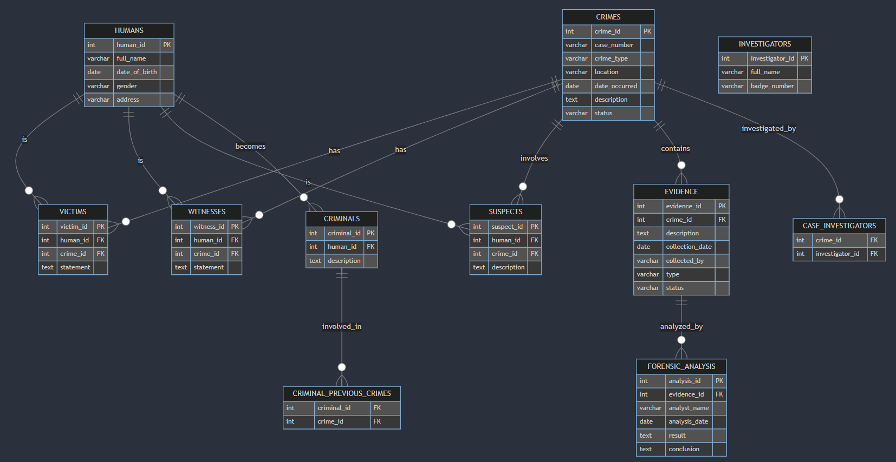

# Database Design

## Overview
This database is designed for managing information related to crime investigations. It includes tables for storing details about crimes, humans involved (victims, witnesses, suspects, investigators, criminals), evidence collected, forensic analysis, and associations between entities. Additionally, it contains views for retrieving consolidated crime and evidence information, as well as triggers for automatic updates and indexes for optimizing query performance.

## Tables
1. **crimes**
   - Stores information about individual crimes, including case number, type, location, date occurred, description, and status.

2. **humans**
   - Stores details about humans involved in crimes, such as full name, date of birth, gender, and address.

3. **victims**
   - Links humans to crimes as victims and includes a statement.

4. **witnesses**
   - Links humans to crimes as witnesses and includes a statement.

5. **suspects**
   - Links humans to crimes as suspects and includes a description.

6. **criminals**
   - Stores information about individuals identified as criminals, along with a description.

7. **criminal_previous_crimes**
   - Tracks the involvement of criminals in previous crimes.

8. **investigators**
   - Stores details about investigators, including full name, badge number, and status.

9. **case_investigators**
   - Establishes associations between crimes and investigators.

10. **evidence**
    - Records details about evidence collected in relation to crimes.

11. **forensic_analysis**
    - Stores results of forensic analysis conducted on evidence.

## ER Diagram

## Views
1. **crime_info**
   - A view providing comprehensive crime information including names of victims, witnesses, and suspects, ordered by date occurred.

2. **evidence_info**
   - A view presenting evidence information along with corresponding crime case numbers.

## Triggers
1. **update_evidence_status**
   - Trigger to automatically update the status of evidence to "Collected" upon insertion into forensic_analysis.

2. **update_crime_status**
   - Trigger to automatically update the status of a crime to "Solved" upon insertion into forensic_analysis.

3. **update_investigator_status**
   - Trigger to update the status of an investigator to "Active" when assigned to a new case.

## Indexes
1. Indexes on frequently used columns in the crimes table and foreign key columns in related tables to optimize query performance.

## Queries
Several SQL queries are provided in `queries.sql` for retrieving specific information from the database, such as crimes in a specific location, suspects associated with crimes, victims of a particular crime type, etc.

